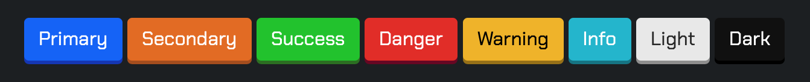
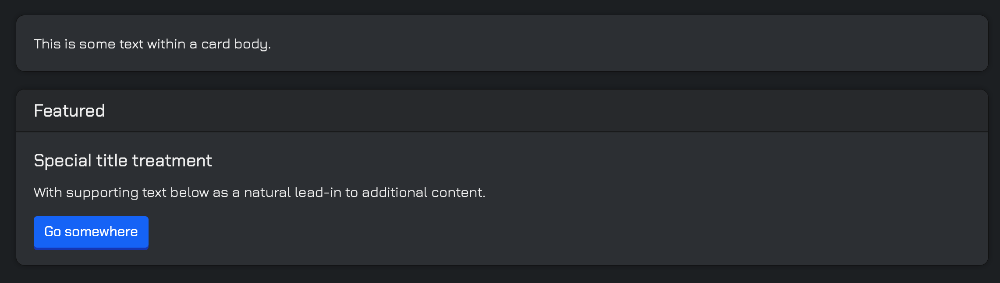
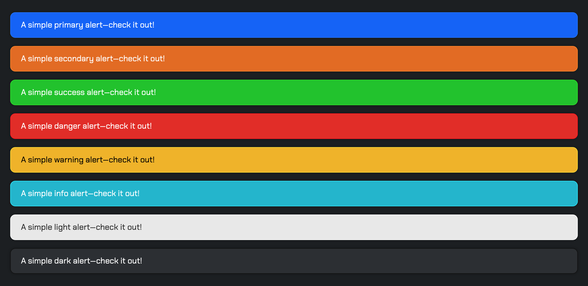
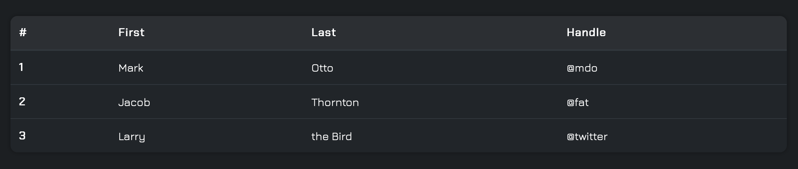
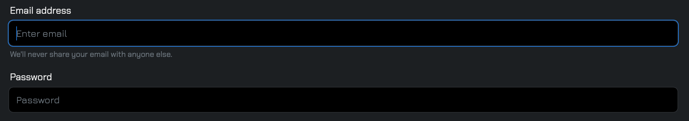
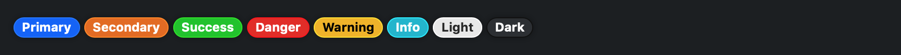

# Bootshadow
## *Bootshadow* is a customisable dark theme for bootstrap 4 components

### Getting started
You can use *Bootshadow* the same way you usually use Boostrap 4, 
since this theme uses the same html classes name than Bootstrap.

All you have to do is to replace `bootstrap.css` (or `bootstrap.min.css`) by `bootshadow.css` ( or `bootshadow.min.css`) in your html page. You do not need to include bootstrap's css file, it is already imported in *Bootshadow*. 

However, *Bootshadow* doesn't include bootstrap's JS scripts, so you will have to import them separetly if needed.

*Happy coding !*

### Exemple
Check an exemple of Bootshadow's components [right here]('https://projects.obrassard.ca/bootshadow') !

***

### Screenshots
Here are some screenshots of differents bootstrap components styled by bootshadow :

